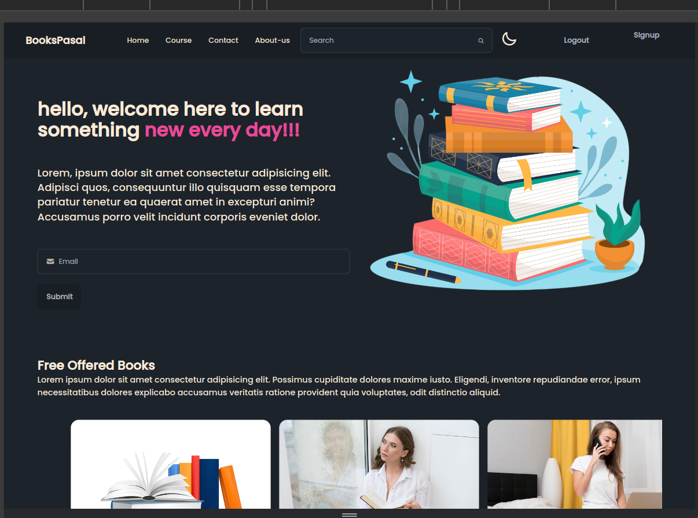

# React + Vite

<hr/>

# BOOKIE - Full Stack MERN Project

BOOKIE is a full stack MERN (MongoDB, Express, React, Node.js) project designed to manage book data with a beautiful UI featuring dark and light modes. It includes user authentication (signup, login, logout) and various pages for displaying book information.

<hr/>



<hr/>

## Features

- **React UI:** Beautiful UI with support for dark mode and light mode.
- **MongoDB:** Data storage for book information using MongoDB Compass.
- **RESTful API:** Backend API to fetch and manage book data.
- **Authentication:** User signup, login, logout functionality.
- **Protected Routes:** Access control with a dedicated page for logged-in users.

## Getting Started

<hr/>

### Prerequisites

- Node.js installed on your local environment
- MongoDB Compass installed for database management

<hr/>

## Installation

To use BOOKIE on your system, follow these steps:

<hr/>

### Clone the repository

```bash
git clone <https://github.com/Adarsha59/Books_store.git>
OR
Downlaod zip
```

### Setup Frontend (React)

```
cd Books_store # Navigate to frontend directory
npm install # Install frontend dependencies
```

### Setup Backend (Node.js, Express)

```
cd backend # Navigate to backend directory
npm install # Install backend dependencies
```

<hr/>

# Developer Information

## Name

Adarsha Paudyal

## Contact Information

- **Email:** code.adarsha@gmail.com
- **GitHub:** [github.com/Adarsha59/](https://github.com/Adarsha59/)

# 😍 Contribution

Contributions are always welcome, open a **Pull Request** and help us improve the project.
